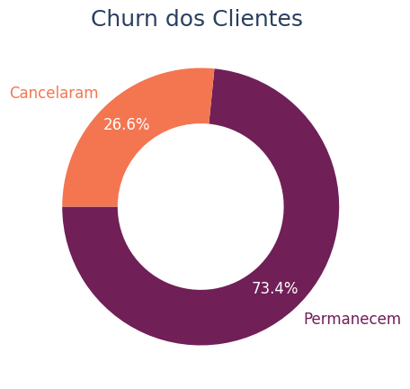
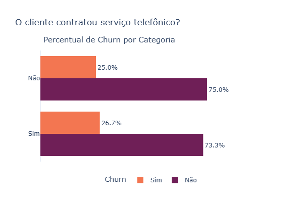
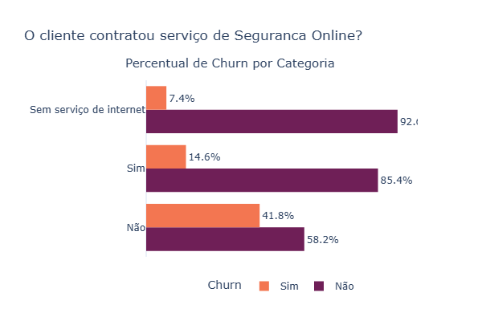
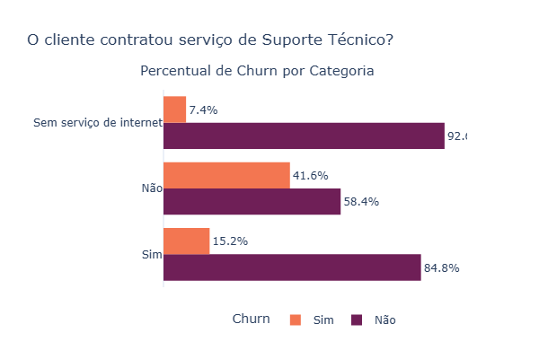
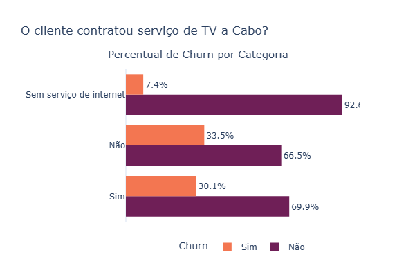
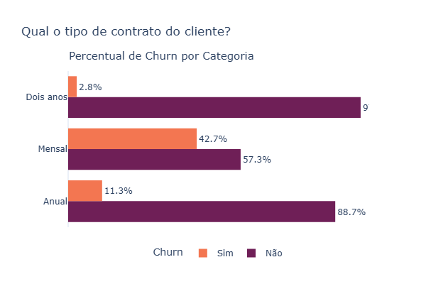
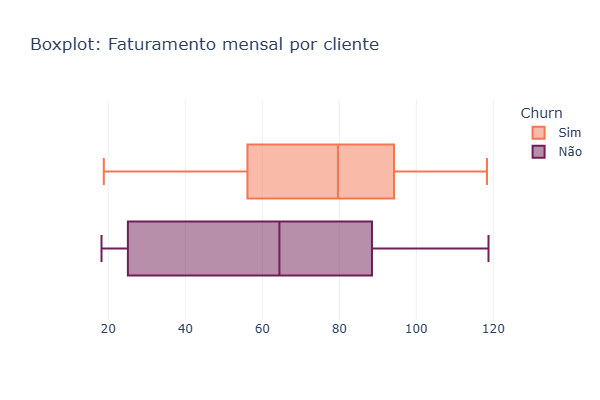
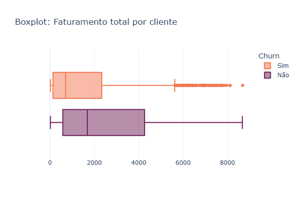
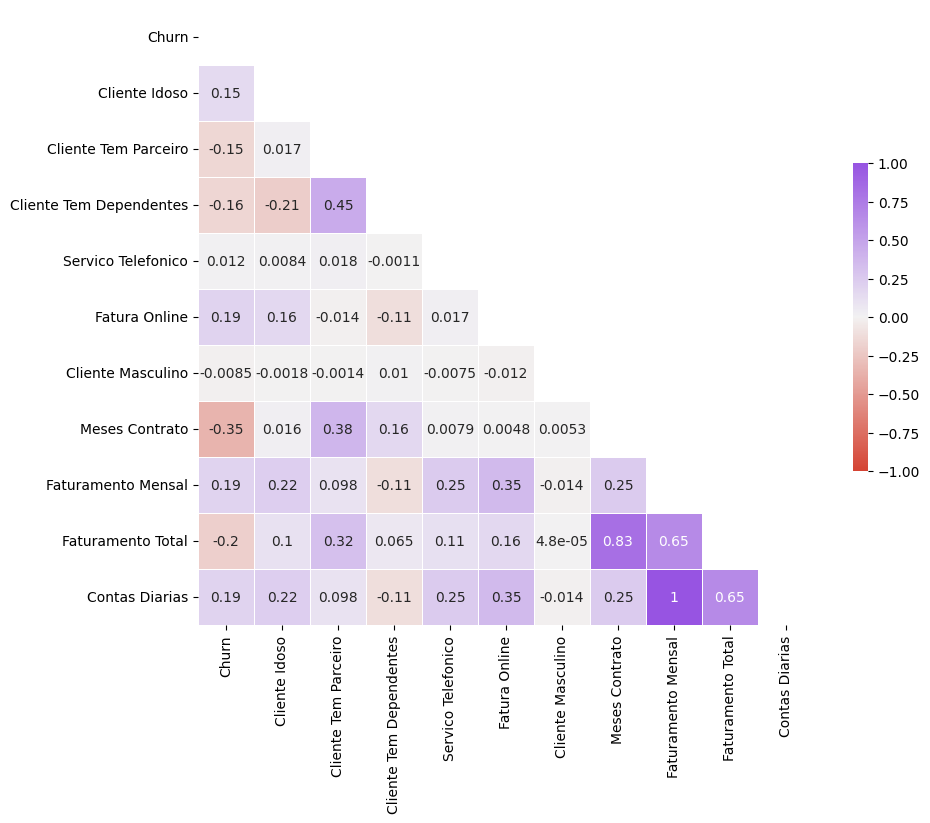
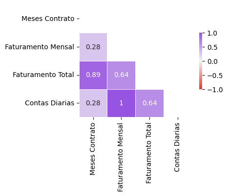

<h1 align="center"> 
 Resolução do Challenge Telecom X - Análise de Evasão de Clientes
 Parte 1
</h1>

Resolução do Challenge 2: Challenge Telecom X (Parte 1) da formação de Data Scientist da Alura.

## Sobre do Desafío:
Você foi contratado como assistente de análise de dados na **Telecom X** e fará parte do projeto **"Churn de Clientes"**. A empresa enfrenta um alto índice de cancelamentos e precisa entender os fatores que levam à perda de clientes.

Seu desafio será **coletar, tratar e analisar os dados**, utilizando **Python** e suas principais bibliotecas para extrair insights valiosos. A partir da sua análise, os demais colegas da  equipe de Data Science poderá avançar para modelos preditivos e desenvolver estratégias para reduzir a evasão.

No desafío praticaremos:

- Importar e manipular dados de uma API de forma eficiente.
- Aplicar os conceitos de ETL (Extração, Transformação e Carga) na preparação dos dados.
- Realizar uma Análise Exploratória de Dados (EDA) e gerar um relatório com insights relevantes.

### Dicionário de dados:
- **customerID**: número de identificação único de cada cliente
- **Churn**: se o cliente deixou ou não a empresa
- **gender**: gênero (masculino e feminino)
- **SeniorCitizen**: informação sobre um cliente ter ou não idade igual ou maior que 65 anos
- **Partner**: se o cliente possui ou não um parceiro ou parceira
- **Dependents**: se o cliente possui ou não dependentes
- **tenure**: meses de contrato do cliente
- **PhoneService**: assinatura de serviço telefônico
- **MultipleLines**: assisnatura de mais de uma linha de telefone
- **InternetService**: assinatura de um provedor internet
- **OnlineSecurity**: assinatura adicional de segurança online
- **OnlineBackup**: assinatura adicional de backup online
- **DeviceProtection**: assinatura adicional de proteção no dispositivo
- **TechSupport**: assinatura adicional de suporte técnico, menos tempo de espera
- **StreamingTV**: assinatura de TV a cabo
- **StreamingMovies**: assinatura de streaming de filmes
- **Contract**: tipo de contrato
- **PaperlessBilling**: se o cliente prefere receber online a fatura
- **PaymentMethod**: forma de pagamento
- **Charges.Monthly**: total de todos os serviços do cliente por mês
- **Charges.Total**: total gasto pelo cliente

## Sobre a Entrega:
Finalize o desafio elaborando um relatório **dentro do próprio notebook** que resuma todo o trabalho realizado. O relatório deve incluir:

- **Introdução**: Explique o objetivo da análise e o problema de evasão de clientes (Churn).
- **Limpeza e Tratamento de Dados**: Descreva os passos realizados para importar, limpar e tratar os dados.
- **Análise Exploratória de Dados**: Apresente as análises feitas, incluindo gráficos e visualizações para identificar padrões.
- **Conclusões e Insights**: Resuma os principais achados e como esses dados podem ajudar a reduzir a evasão.
- **Recomendações**: Ofereça sugestões baseadas na sua análise.

Certifique-se de que o relatório esteja bem estruturado, claro e com as visualizações que sustentam suas conclusões.

## Sobre o desenvolvimento:
- O desenvolvimento foi feito usando o [Google Colaboratory](https://colab.research.google.com/).
- O notebook com o desenvolvimento pode ser revisado [aqui](Alura_DataScience_Challenge2.ipynb).
- Os requerimentos estão listados do arquivo [requirements.txt](requirements.txt).

## Relatotio:

### Introdução:
Atuamos como analistas de dados no projeto **"Churn de Clientes"** na empresa **Telecom X**. A empresa enfrenta um alto índice de cancelamentos e o projeto tem como objetivo entender os fatores que levam à perda de clientes (Churn). Nesta primeira parte do projeto temos a tarefa de **coletar, tratar e analisar os dados**, utilizando **Python** e suas principais bibliotecas para extrair insights valiosos. A partir da nossa análise, os demais colegas da equipe de Data Science poderão avançar para modelos preditivos e desenvolver estratégias para reduzir a evasão.

Para um melhor acompanhamento de cada uma das etapas dividimos o relatorio em 4 partes: 
 - Primeiro, Limpeza e Tratamento de Dados. Aqui comentamos como realizamos a leitura dos dados, verificação de inconsistencias, transformações para tratar inconsistencias e obter uma base corretamente estrururada, padronizada, com os formatos de dados apropriados e mais acessível.
 - Segundo, Analise Exploratória de Dados. Aqui, com ajuda de métricas e gráficos, analisamos as variáveis e sua relação com o Churn de Clientes.
 - Terceiro, listamos as principais conclusões a partir da análise exploratoria.
 - Finalizamos apresentando algumas recomendações.

### Limpeza e Tratamento de Dados
A seguir, descrevemos os passos realizados para importar, limpar e tratar os dados. Maiores detalhes podem ser encontrados no seguinte [notebook](https://github.com/Angel-Arroyo-H/alura-data-science-challenge-2/blob/main/Alura_DataScience_Challenge2.ipynb).
- Os dados foram extraidos do seguinte [URL](https://raw.githubusercontent.com/alura-cursos/challenge2-data-science/refs/heads/main/TelecomX_Data.json), os dados de origem estão em formato JSON, usamos as livrarias `request`, `json` e `pandas` para importar os dados, primeiro, para um diccionario e posteriormente para um DataFrame após normalizar os dados contidos no diccionario.
- Os dados não apresentaram valores nulos em todos os campos, no entanto a coluna `Churn` apresentou 224 registros (3% do total) preenchidos com apenas um espaço, dado que o `Churn` é a variável de interesse no estudo decidimos remover esses registros da base.
- Após revisar as descrições das outras variáveis e olhar para os valores únicos delas, dividimos elas pelo tipo de variáveis que esperavamos. Isto é, variáveis booleanas, categóricas, inteiras e float.
- Nas variáveis booleanas reemplazamos os valores por `True` e `False`. No caso da variável `customer_gender` (genero do cliente), transformamos a variável para `customer_is_male` (cliente é homem) a fim de ser compatível com os valores `True` e `False`. Dessa forma transformamos o tipo dessas variáveis de `object` para `bool`.
- No caso das variáveis numéricas apenas a variável `account_Charges_Total` apresentava algumas inconsistencias com 11 valores em branco (0,16% do total), devido à pouca quantidade de registros e ao fato de que todos esses registros caiam apenas na categoria `Churn=False` decidimos remover eles dos dados. Após isso conseguimos transformar esse campo para `float`.
- Ejecutamos um resumo com as principais estatísticas para as variáveis numéricas (int e float) e não observamos valores inconsistentes nessas variáveis.
- Fizemos uma contagem de valores por categoria para as variáveis não numéricas (bool e object) e não observamos valores nem categorias inconsistentes nessas variáveis.
- Para tornar os dados mais acessíveis e padronizados, traduzimos e substituimos as categorias das variáveis categóricas (tipo object) e os nomes de todas as variáveis (colunas).
- Adicionamos a coluna `contas_diarias` a partir da coluna `faturamento_mensal` (antes `account_Charges_Monthly`).
- Como passo final nesta etapa, resetamos os índices e salvamos em formato CSV os dados tratados (salvamos uma [copia](https://github.com/Angel-Arroyo-H/alura-data-science-challenge-2/blob/main/dados/dados_tratados.csv) neste repositório).

### Análise Exploratória de Dados

#### Percentagem de Churn
O churn dos clientes da **Telecom X** é de 26,6%.

#### Churn vs Variáveis
Revisando o churn vs as variáveis disponíveis nos dados temos que:
- No caso do género, não se observa diferença significativa no percentual de Churn entre mulheres e homens.

  

- Se observa um alto percentual de Churn em clientes de mais de 65 anos. Mas isso pode ser explicado pela mortandade nessa faixa etária.

  

- O percentual de Churn é maior em clientes que não tem parceiro ou parceira.

  

- O percentual de Churn é maior em clientes que tem dependentes.
  
  

- Não observamos diferenças significativas no percentual de Churn entre clientes que contrataram e clientes que não contrataram o serviço telefónico.
  
  

- Assim também não parece ter diferenças expressivas no percentual de Churn entre clientes que não tem serviçõ telefónico, clientes que contrataram o serviçõ telefónio mas que não contrataram o serviçõ de multiplas linhas e os que contrataram ambos os serviços.
  
  

- Por outra parte, o percentual de Churn (42%) de clientes que contrataram assinatura de internet de Fibra Ótica é expressivamente maior ao percentual de Churn de clientes que contrataram assinatura de internet DSL ou de clientes que não contrataram o serviço de internet. Sendo que os clientes que contrataram o serviço de internet de Fibra Ótica representam o 44% do total de clientes. A qualidade do serviço de internet de Fibra Ótica pode ser um fator relevante no Churn dos clientes.
  
  

- No caso do serviço de Segurança Online, os clientes que não assinaram o serviço (50% dos clientes), apresentam um percentual de Churn de 41,8%. Acreditamos que uma experiencia ruim relacionada à segurança online pode derivar em um cancelamento dos serviços, talvez maior difusão da importancia da contratação do serviço junto com promoções possam reduzir o Churn de clientes.
  
  

- De forma similar no caso de Backup Online, observamos um percentual de Churn de quase 40% em clientes que não contrataram o serviço, sendo que esses clientes representam o 44% dos clientes. A falta de backup pode derivar em perda de informação, uma ocorrencia dessas pode levar ao Churn do cliente. Acreditamos que vale testar essa hipotesse, e se a hipótese for valida incentivar a contrataçao do serviço pode ser um caminho para reduzir o Churn de Clientes. 
  
  

- No caso do serviço de proteção de dispositivo, observamos um percentual de Churn de 39% nos clientes que não contrataram o serviçõ, esses clientes representam o 43% do total de clientes.
  
  

- No caso do serviço de suporte técnico, os clientes que não contrataram o serviço (49%) tem o maior percentual de Churn com um (41,6%)
  
  

- No caso do serviço de TV a Cabo, não observamos diferenças marcantes no percentual de Churn entre os clientes que contrataram ou não o serviço. O percentual de churn é menor em clientes que não tem o serviço de internet.
  
  

- No caso do serviço de Streaming de Filmes, não temos diferenças significativas entre clientes que contrataram e clientes que não contrataram o serviço
  
  

- No caso do tipo de contrato do cliente temos que clientes com assinatura mensal apresentam um percentual de Churn significativamente maior (42,7%). É possivel que impulsionar os outros tipos de contratação (anual ou dois anos) possa reduzir o nivel de Churn dos Clientes.
  
  

- No caso do serviço de fatura online, o percentual de Churn (33,6%) é maior nos Clientes que recevem a fatura online.
  
  

- No caso da forma de pagamento, o Churn (45,3%) é maior nos Clientes que pagam com Cheque Eletrónico. Sendo eles o 33,6% dos Clientes. Talves uma revisão dos problemas que tem os Clientes com essa forma de pagamento seja pertinente.
  
  

- Comparando a distribuição do número de meses de contrato podemos observar que Clientes que cancelaram o contrato tem um número menor de meses de contrato e clientes com contrato vigente tem maior antiguedade de contrato. Isto é, o número de meses de contrato pode estar relacionado com o Churn de Clientes.
  
  

- Enquanto ao faturamento mensal, clientes que cancelaram contrato (Churn), tem uma concentração de faturamento mensal em valores maiores comparados com os clientes que permanecem com contrato ativo. Isto é, o faturamento mensal pode estar relacionado com o Churn de Clientes.
  
  

- No caso do faturamento total também observamos diferenças entre os grupos de clientes que cancelaram o contrato e o grupo que permanece. No entanto, é possivel que esta veiável tenha uma alta correlação com as variáveis de número de meses de contrato e faturamento mensal, pelo que uma analise de correlação pode ser pertinente.
  
  

- A distribuição das contas diarias traz a mesma informação que o faturamento mensal devido ao calculo dela, recomendamos omitir uma das duas variáveis na modelagem.
  
  

#### Correlação
Para o cálculo das correlações omitimos as variáveis categóricas. Porém, incluimos as variáveis booleanas. Calculamos a matriz de correlação de Pearson (que é equivalente ao coeficiente Phi para variáveis binarias, e equivalente ao Ponto-Biserial no caso de comparação de uma variável binária e uma numérica).

- Variáveis como Serviçõ Telefónico ou Género do Cliente (Cliente Masculino) tem uma correlação muito baixa com o Churn.
- Meses de contrato tem uma alta correlaçao inversa com o Churn. Ou seja, o Churn acontece menos em clientes com maior antiguedade.
- Faturamento mensal e Contas Diarias tem uma correlação possitiva com o Churn. Isto é, o Churn acontece mais em clientes com valores mais altos de faturamento.
- Por outro lado Faturamento Total, Cliente tem Dependentes e Cliente tem Parceiro(a) tem correlações negativas com o Churn. Isso significa que o Churn é maior quando o faturamento é menor (isso é coherente com a correlação observada com os Meses de Contrato), e o percentual de Churn é maior para clientes sem Parceiro(a) e sem Dependentes.
- Se seconsideramos as variáveis numéricas (as 4 últimas) podemos observar que apenas as variáveis Cliente tem Dependentes e Cliente tem Parceiro apresentam uma correlação relativamente alta, se recomenda tomar cuidado com ela e utilizar ferramentas adicionais como VIF (Fator de inflação da Variáncia) para verificar se essa correlação pode gerar problema de multicolinearidade.
- Enquanto às variaveis (sem o Churn) altas correlações entre as variáveis numéricas, por enquanto deixamos a analisis para depois porque precisaremos verificar se a correlação de Pearson é a mais apropriada para estas variáveis.

A seguir graficamos os histogramas das variáveis numéricas.

Podemos dizer que a distribuição dessas variáveis não é normal. Por tanto, a correlação de Spearman - que mostramos a seguir - resulta mais apropriada para essas variáveis.

Os valores resultantes mostram uma alta correlação entre quase todas as variáveis numéricas. Isso explicado pelo fato da variável Contas Diarias ser uma função da variável Faturamento Mensal. Por outra parte tem muito sentido o Faturamento Total estar altamente correlacionado com os Meses de Contrato e com o Faturamento Mensal. Para evitar o problema de multicolinearidade recomendamos excluir as variáveis Faturamento Total e Contas Diarias. Observe que Faturamento Mensal e Meses de Contrato tem a menor correlação entre as variáveis numéricas.

### Conclusões e Insights

- O processo de ETL (extração, transformação e carregamento) de dados que inclui limpar e organizar os dados é um passo previo fundamental à análise descritiva e modelagem estatística.
- Os dados brutos apresentaram aproximadamente um 3% de registros que tiveram que ser excluidos por apresentar dados inconsistentes.
- Para tornar os dados mais acessíveis traduzimos o nome das colunas e categorias para o portugues seguindo o padrão de minusculas separadas com underline, no caso das colunas.
- Após análise exploratória dos dados que inclui a correlação dos mesmos, identificamos que as variáveis Género, Serviço Telefónico e Serviço de Multiplas Linhas podem não trazer informação relevante para explicar o Churn de Clientes. E que considerar as variáveis Faturamento
- 
- Por outra parte, observamos um percentual alto de Churn en clientes com as seguintes características:
  - Clientes com parceiro(a).
  - Clientes com dependentes.
  - Clientes que contrataram internet de Fibra Ótica.
  - Clientes que não contrataram serviço de Segurança Online.
  - Clientes que não contrataram serviço de Backup Online.
  - Clientes que não contrataram serviço de Proteção de Dispositivo.
  - Clientes que não contrataram serviço de Suporte Técnico.
  - Clientes com tipo de contrato mensal.
  - Clientes que recebem a fatura online.
  - Clientes que pagam com Cheque Eletrônico.
  - Clientes mais novos (menor número de meses de contrato).
  - Clientes com um Faturamento Mensal maior.

### Recomendações  
  
